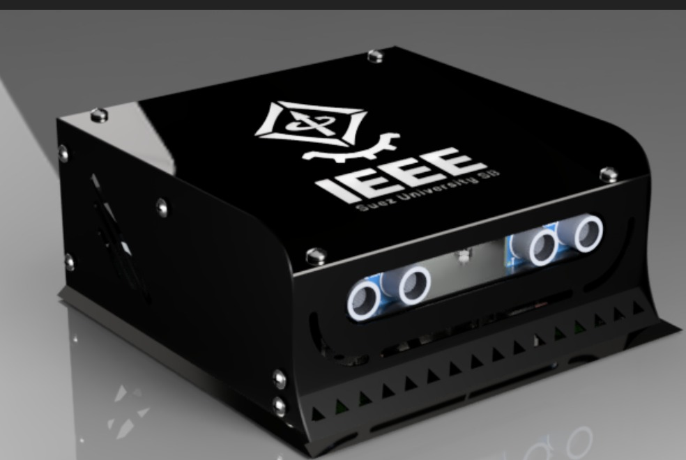

# Minisumo robot




## About 
This repository contains the project developed by the members of CEIMTUN-RAS at Universidad Nacional de Colombia for a minisumo robot.

### Structure
The repository contains several branches each for a different purpose.
* [master](https://github.com/Ceimtun-RAS/minisumo): Production ready code.
* [develop](https://github.com/Ceimtun-RAS/minisumo/tree/develop): Workplace for developing new features.
* [test](https://github.com/Ceimtun-RAS/minisumo/tree/test): 

## Getting started
You can get your own copy of this project by [forking it](https://github.com/Ceimtun-RAS/minisumo/fork), or if you don't have a github account click this [link](https://github.com/Ceimtun-RAS/minisumo/archive/refs/heads/master.zip) to get a zip file of the project.

[Members of the organization](https://github.com/orgs/Ceimtun-RAS/people) can clone the repository directly without forking it. Use either the [GitHub Dekstop](https://desktop.github.com/) or the command line to clone the repository.

```
git clone https://github.com/Ceimtun-RAS/minisumo.git
```

### Adding remote branches
Remote branches can be added to your local repo using the command```git checkout <name-of-remote-branch>```. Here are two important  branches for this project. 

```
git checkout develop 
git checkout test
```

## Contributing 
THis is a open source project and anyone is encourage to contribute. if you are interested in contributing please check the [style guide](#style-guide).

### Prerequisites
Before starting: 
* Setup git and a github account.
* Have ready an Integraded Development Environment (IDE) for writing code. [arduino IDE](https://www.arduino.cc/en/software) or vscode are recommended. 

### Contributing process

1. [members of the organization](https://github.com/orgs/Ceimtun-RAS/people) can clone the repository directly. External contributors must fork the project and then clone it to their local computer.  
```
git clone <repo-url>
```
2. Move to the ```develop``` branch and implement your changes.
```
git checkout develop 
```
1. Commit you changes with an __informative git message__. be sure to follow the [guidelines and conventions](#git-message-conventions).
2. push your changes and submit them for review: via pull request for external contributors and ```push``` command for members of the organization. 

## style guide 
### git message conventions


* feat (new feature for the user, not a new feature for build script)
* fix (bug fix for the user, not a fix to a build script)
* docs (changes to the documentation)
* style (formatting, missing semi colons, etc; no production code change)
* refactor (refactoring production code, eg. renaming a variable)
* test (adding missing tests, refactoring tests; no production code change)

>> git message conventions taken from [<sup>2</sup>](#references)

## References
1. [Google C++ Style Guide](https://google.github.io/styleguide/cppguide.html)
2. [Karma Git Commit Msg](http://karma-runner.github.io/1.0/dev/git-commit-msg.html)
   
[](https://docs.google.com/document/d/1QrDFcIiPjSLDn3EL15IJygNPiHORgU1_OOAqWjiDU5Y/edit#heading=h.j8e4paqkfz0q)
[](https://github.com/angular/angular/blob/22b96b9/CONTRIBUTING.md#rules)
[](https://gist.github.com/robertpainsi/b632364184e70900af4ab688decf6f53)