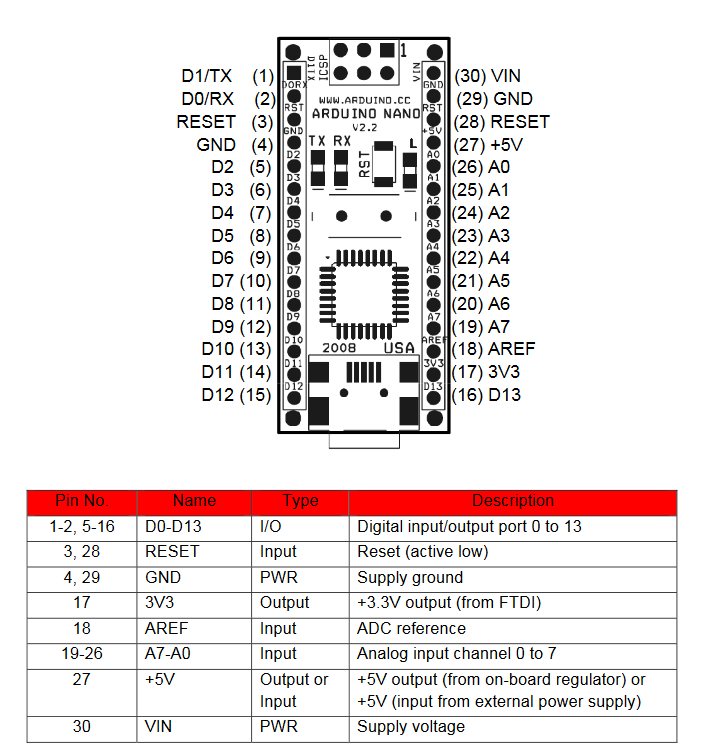

# Notes 
tool> bootloader old

shield might be burned

## minisumo components
- sharp GP2Y0A60SZLF analog distance sensor
- QTR-1RE reflectance sensor
- tb6612 driver DC motor 
- DC motor 
- Arduino nano board

## Pinout 

| Arduino   | Driver |
|-----------|:------:|
| D6 (PWM)  | PWMA |
| D4        | AIN2 |
| D9        | AIN1 |
| 5V        | STBY |
| D7        | BIN1 |
| D8        | BIN2 |
| D5 (PWM)  | PWMB |
 

- reflectance sensor S1 pin: A1
- reflectance sensor S2 pin: A2

- Motor Right pins: 2, 4, 6 (PWM)
- Motor Left  pins: 7, 8, 3 (PWM)
   
  

# Miscellaneous 
homogeneous transform 

https://www.arduino.cc/reference/en/libraries/geometry/

https://aprendiendoarduino.wordpress.com/2019/05/06/construccion-y-programacion-de-robot-minisumo/

https://www.instructables.com/SimpleSumo-Educational-Fighting-Robots/

[Rules](http://robogames.net/rules/all-sumo.php)
